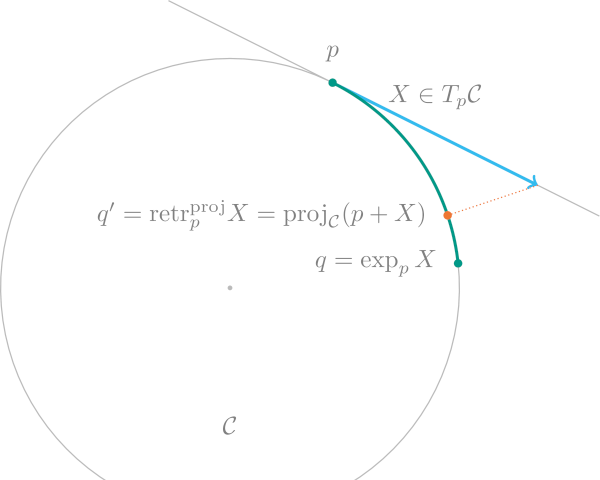

## [Retractions and inverse Retractions](@id sec-retractions)

The [exponential and logarithmic map](@ref exp-and-log) might be too expensive to evaluate or not be available in a very stable numerical way. Retractions provide a possibly cheap, fast and stable alternative.

The following figure compares the exponential map [`exp`](@ref)`(M, p, X)` on the [Circle](https://juliamanifolds.github.io/Manifolds.jl/latest/manifolds/circle.html) `(ℂ)` (or [`Sphere`](https://juliamanifolds.github.io/Manifolds.jl/latest/manifolds/sphere.html)`(1)` embedded in $ℝ^2$ with one possible retraction, the one based on projections. Note especially that ``\mathrm{dist}(p,q)=\lVert X\rVert_p`` while this is not the case for ``q'``.



```@autodocs
Modules = [ManifoldsBase]
Pages = ["retractions.jl"]
Order = [:function]
Private = false
Public = true
```

## Types of Retractions

To distinguish different types of retractions, the last argument of the (inverse) retraction
specifies a type. The following ones are available.

```@autodocs
Modules = [ManifoldsBase]
Pages = ["retractions.jl"]
Order = [:type]
```

## The lower layer functions

While you should always add your documentation to [`retract`](@ref) or [`retract!`](@ref) when implementing new manifolds, the actual implementation happens on the following functions on [the lower layer](@ref design-layer3).

```@autodocs
Modules = [ManifoldsBase]
Pages = ["retractions.jl"]
Order = [:function]
Public = false
Private = true
```
